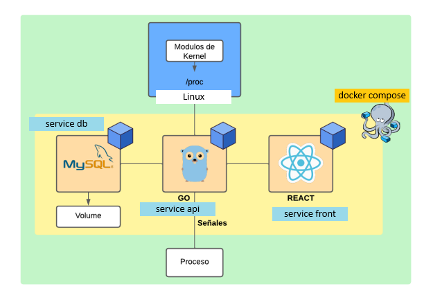
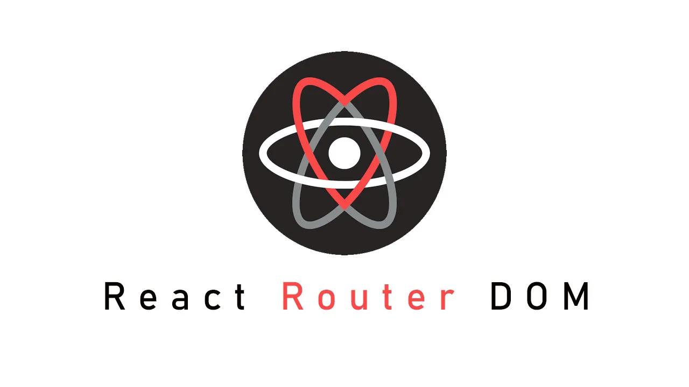
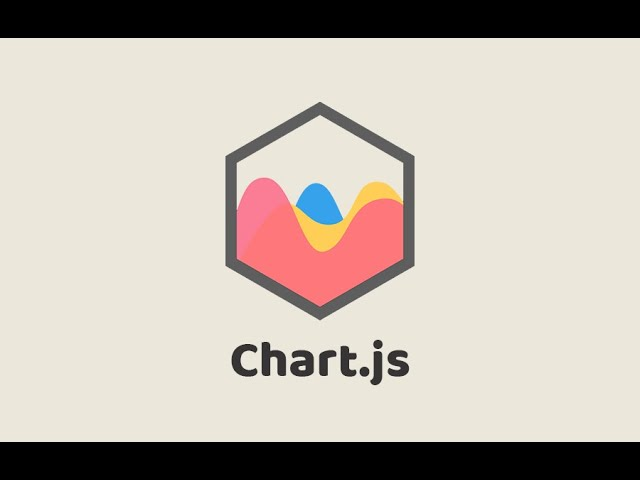
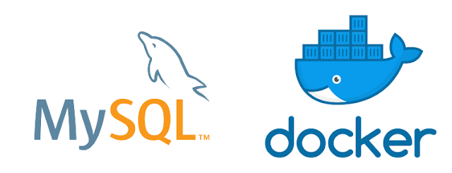
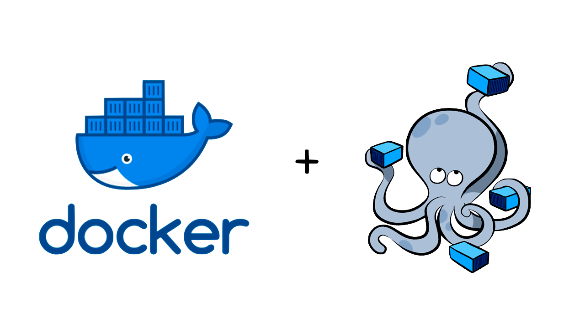

Manual técnico con explicación de todos los componentes utilizados en el proyecto por ejemplo Web UI, Database, Simulador de Estados, Módulos, etc. 

# PROYECTO 1 

| Sergio André Lima Corado | 202100154 |
| ----------- | --------- |

---
---

# Manual Técnico 

---

## Arquitecura del Proyecto



### Descripción de la Arquitectura

El proyecto se compone de 3 partes principales:

1. **Frontend**: Es la parte visual del proyecto, en la cual el usuario interactúa con la aplicación. Se compone de una página web que se conecta con el backend para obtener información y mostrarla al usuario.
2. **API**: Es el intermediario entre el frontend y el backend. Se encarga de redirigir las peticiones del frontend al backend correspondiente y a la base de datos.
3. **Database**: Es el almacenamiento de la información. Se compone de una base de datos en la cual se almacena la información de los datos de utilización de los recursos, los procesos y los estados de los mismos.

---
---

## Frontend


### React

React es una biblioteca de JavaScript para construir interfaces de usuario. Es mantenido por Facebook y una comunidad de desarrolladores individuales y empresas. React puede utilizarse como base en el desarrollo de aplicaciones de una sola página o móviles. Sin embargo, su objetivo principal es proporcionar velocidad, simplicidad y escalabilidad. React procesa solo las actualizaciones de la interfaz de usuario, lo que resulta en un rendimiento más rápido y una mejor experiencia del usuario.

- #### Vite
Se utilizó Vite para la creación del proyecto de React. Vite es un nuevo compilador de frontend que sirve como reemplazo de Create React App. Vite es un proyecto de Evan You, el creador de Vue.js, y es una herramienta que permite a los desarrolladores de frontend crear aplicaciones web modernas con una configuración mínima.

- #### Nginx

Se utilizó nginx para el despliegue del proyecto de React. Nginx es un servidor web ligero de alto rendimiento, que se utiliza para servir contenido estático y actuar como proxy inverso para el backend, en este caso la api.

---

### Componentes

#### Barra Superior

Es un componente que se muestra en la parte superior de la página. Contiene el nombre del proyecto y el logo además brinda acceso a las diferentes secciones de la página. 

Se elaboró con ```React-Router-Dom``` para poder redirigir a las diferentes secciones de la página.



#### PieChart

Es un componente que se muestra en la sección de recursos. Contiene un gráfico de pastel que muestra el porcentaje de uso de los recursos, según los requerimientos de este proyecto es para captar el porcentaje de uso de la CPU y la memoria RAM. 

Se elaboró con ```Chart.js``` para poder mostrar el gráfico de pastel.



### Graph2d


Se utilizó la librería ```vis.js``` para mostrar el gráfico de líneas que muestra el uso de la CPU y la memoria RAM en el tiempo.

Además también 


---

# Database

## MySQL



MySQL es un sistema de gestión de bases de datos relacional desarrollado bajo licencia dual: Licencia pública general/Licencia comercial por Oracle Corporation y está considerada como la base de datos de código abierto más popular del mundo, y una de las más populares en general junto a Oracle y Microsoft SQL Server, todo esto gracias a su rendimiento, confiabilidad y facilidad de uso.

En este caso se utilizó también un **volumen de Docker** para poder almacenar la información de la base de datos y que esta no se pierda al reiniciar el contenedor.


--- 
 
# Backend (API)

## Golang


El backend es una API desarrollada en Golang. Go es un lenguaje de programación de código abierto que facilita la creación de software simple, confiable y eficiente. Go es un lenguaje de programación compilado, concurrente, imperativo, estructurado y orientado a objetos.

La API permite la conexión entre el frontend y la base de datos. Además, se encarga de procesar las peticiones del frontend y redirigirlas a la base de datos. 
Así mismo, con la misma lógica, la API se encarga de ejecutar los módulos de kernel de Linux para obtener la información de los recursos y los procesos.

Algunos endpoints de la API importantes son:


- **/api/getLive**: Este endpoint se encarga de obtener la información de los recursos en tiempo real, es decir, la información de la CPU y la memoria RAM.
Devuelve un json con la información de la CPU y la memoria RAM.

~~~ json

{
    "freeRam": 74.75,
    "usedRam": 25.25,
    "ram": 25.25,
    "cpu": 25.21
}
~~~

- **/api/getHistory**: Este endpoint se encarga de obtener la información de los recursos en el tiempo, es decir, la información de la CPU y la memoria RAM en el tiempo.

Devuelve un json con la información de la CPU y la memoria RAM en el tiempo.

~~~ json

{
    "cpu": [
        {
            "time": "2021-10-10T00:00:00Z",
            "value": 25.21
        },
        {
            "time": "2021-10-10T00:00:01Z",
            "value": 25.21
        },
        {
            "time": "2021-10-10T00:00:02Z",
            "value": 25.21
        }
    ],
    "ram": [
        {
            "time": "2021-10-10T00:00:00Z",
            "value": 25.25
        },
        {
            "time": "2021-10-10T00:00:01Z",
            "value": 25.25
        },
        {
            "time": "2021-10-10T00:00:02Z",
            "value": 25.25
        }
    ]
}
~~~

- **/api/getTree**: Este endpoint se encarga de obtener la información de los procesos en el sistema operativo.

Devuelve un json con la información de los procesos en el sistema operativo.

~~~ json

{
    "name": "systemd",
    "children": [
        {
            "name": "systemd-journal",
            "children": [
                {
                    "name": "systemd-journal-flush",
                    "children": []
                }
            ]
        },
        {
            "name": "systemd-udevd",
            "children": []
        }
    ]
}
~~~

---

# Docker



Se utilizó Docker para el despliegue de la aplicación. Docker es una plataforma de código abierto que permite a los desarrolladores construir, empaquetar y distribuir aplicaciones dentro de contenedores. Los contenedores son una forma de empaquetar aplicaciones con todas sus dependencias y ejecutarlas de forma aislada en cualquier entorno. Gggg

Se utilizó un archivo ```docker-compose.yml``` para poder levantar los contenedores de la base de datos, la API y el frontend.

## Docker Compose

Se utilizó Docker Compose para poder levantar los contenedores de la base de datos, la API y el frontend. Docker Compose es una herramienta que permite definir y ejecutar aplicaciones Docker de múltiples contenedores. Con Compose, se define una aplicación multi-contenedor en un archivo YAML, luego se crea y se inicia todo el entorno de la aplicación con un solo comando.
